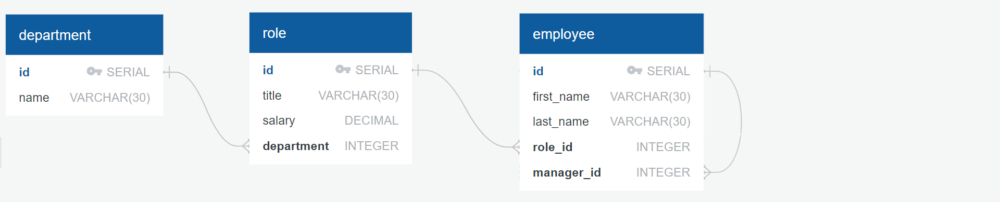

# Employee Database Management Tool

This Node.js application provides a Command Line Interface (CLI) application for managing employees, roles, and departments in a company. It allows users to view and manage company data through a series of prompts and selections.

## Installation

To install this project, you need to have Node.js and npm (Node Package Manager) installed on your machine. Then, follow these steps:

1. Clone the repository:

```sh
git clone git@github.com:pradeepkhanal23/employee-database-manager.git
cd employee-database-manager
```

2. Install Dependencies

```sh
npm install
```

3. Ensure you have a PostgreSQL database set up with the required tables. You can find the database setup and schema in the db directory.

## Usage

To start the CLI application, run:

```sh
npm run dev
```

OR

```sh
node server.js
```

You will be presented with a list of options to choose from, such as viewing all departments, roles, employees, or adding new entries to the database.

## Database Schema

Here is the database schema that this project follows:



## Video Demo

Click on the image below for full project demo that explains the functionality of the application.

<a href="https://www.youtube.com/watch?v=TyvEd4A6Cvg&ab_channel=PradeepKhanal" target="_blank" rel="noreferrer noopener" style="position: relative; display: inline-block;">
  
  <button style="position: absolute; top:50%; left:50%;">Click to View</button>
</a>

## Features

- View all departments
- view all roles
- view all employees
- add a department
- add a role
- add an employee
- update an employee role
- quit the application

## Technologies Used

- Node js
- Express.js
- Inquirer
- Figlet
- postgres-node (pg)

## Questions

If you have any questions, feel free to reach out:

- **GitHub**: [pradeepkhanal23](https://github.com/pradeepkhanal23)
- **Email**: [pradeepkhanal642@gmail.com](mailto:pradeepkhanal642@gmail.com)
